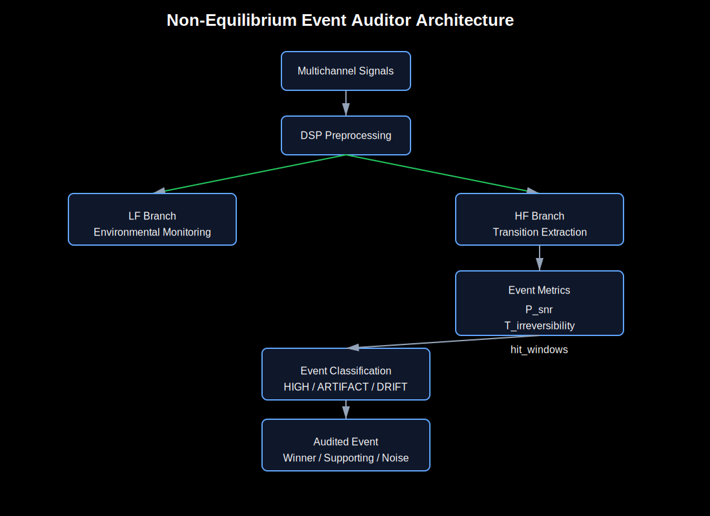

# non-equilibrium-auditor

**Time-Series Event Auditing for Structural Collapse Detection**

`non-equilibrium-auditor` is an experimental toolkit designed to detect and audit **non-equilibrium transitions** and **structural collapse events** in complex, noisy multi-channel time-series data.

Instead of relying on black-box machine learning models, this system combines DSP-based filtering, structural physical metrics, and artifact auditing into a transparent, explainable pipeline.

---

## The "Death Signal" Origin
The project was born from a biological hypothesis: *Do systems—cells or organisms—emit a specific physical 'signal' at the exact moment of structural collapse or death?*.

While this started with a "Death Signal" concept, it evolved into a rigorous engineering tool for detecting **short-lived non-equilibrium transitions** embedded in heavy noise. Whether it is infrastructure failure, physiological collapse, or machine breakdown, this tool audits the "moment of decay" with precision.

---

## System Architecture



The pipeline separates signal analysis into two conceptual branches to isolate the event from the environment.

### LF Branch — Environmental Monitoring
Tracks slow behavior like baseline drift, long-term oscillations, and interference. It acts as a **noise map** to help dismiss environmental "fake" events.

### HF Branch — Transition Extraction
Searches for rapid structural changes. It evaluates candidates using metrics like local SNR, irreversibility, and persistence.

---

## Event Metrics
Each candidate is evaluated using interpretable metrics:

* **P_snr**: Local signal contrast against surrounding noise.
* **T_irreversibility**: Measures the "arrow of time" asymmetry between the rising and falling phases of an event.
* **hit_windows**: Persistence indicator; counts how many adjacent windows support the event.
* **Ratio_MirrorSym**: Detects symmetric artifacts often produced by mechanical sensor errors or DSP side-effects.

---

## Components

### 1. Python Engine (`death_audit_v15.py`)
The core backend that processes raw multi-channel data. 
* **DSP Armor**: Features specialized filtering to handle drift, 50Hz hum, and DC offsets without destroying the target signal.
* **Triage**: Ranks and classifies events into categories like `HIGH`, `LOW_A_CANDIDATE`, or `LOW_B1_SYMMETRIC_ARTIFACT`.
* **Exporter**: Generates `result.json` for visual auditing.

### 2. Interactive UI (`index.html`)
A browser-based analysis interface to visualize and verify detected events.
* **Capabilities**: Load `result.json`, run browser-side "Quick Audits" on raw CSVs, or generate synthetic signals to test the algorithm.

---

## Quick Start

### Step 1: Run the Analysis
Execute the Python pipeline to process your data and generate a result file.
```bash
python death_audit_v15.py


```

### Step 2: Open the Audit UI

Open `index.html` in your browser. Then:

1. Load the generated `result.json`.
2. Or use the **Synthetic Generator** to see how the auditor handles drift and noise in real-time.

---

## Project Goal

This project asks a fundamental research question: *Can complex transitions be audited in a way that remains interpretable?*. It is an open exploration of structural decay, from infrastructure to complex systems research.

---

## License

© DIMProductions
Research use only.
